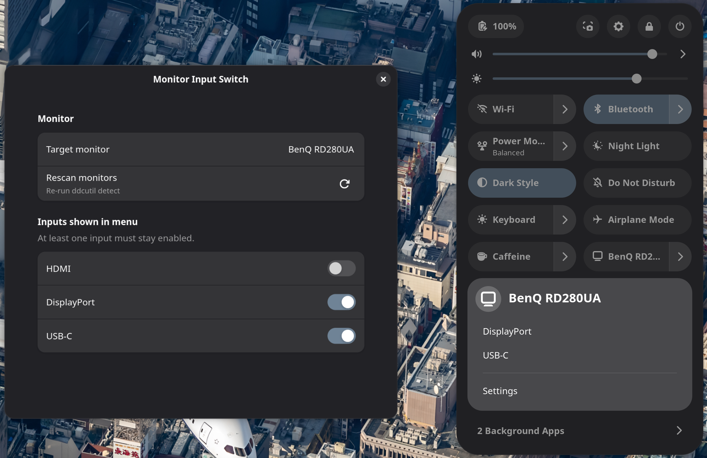

# Monitor Input Switch



A GNOME Shell extension that switches an external monitor's input source via `ddcutil`. Lives in the Quick Settings panel.

**Features:**
- Switch to HDMI (`0x11`), DisplayPort (`0x0f`), USB-C (`0x1b`) via DDC/CI VCP code `0x60`
- Choose one target monitor if multiple detected
- Customize which inputs to show

## Requirements

- GNOME Shell 48, 49, or 50
- `ddcutil` installed (`which ddcutil` to check) and `ddcutil detect` should list your monitor

## Install

### From Gnome Extensions (Recommended)

Coming soon.

### From Latest GitHub Release

1. Download the latest release from [Releases](https://github.com/nemofq/monitor-input-switch/releases).

2. Install the extension:

   ```sh
   gnome-extensions install -f ~/Downloads/monitor-input-switch@nemofq.github.io.zip
   ```

3. Restart the session by logging out.

4. Enable the extension in [Extension Manager](https://flathub.org/en/apps/com.mattjakeman.ExtensionManager) or by running:

   ```sh
   gnome-extensions enable monitor-input-switch@nemofq.github.io
   ```

## Contributing

Feel free to submit an issue or pull request.

## Acknowledgments

Thanks to these projects for the ideas and groundwork that made this extension possible.

- [ddcutil](https://github.com/rockowitz/ddcutil)
- [display-switcher](https://github.com/skandinaff/display-switcher)
- [Control Monitor Brightness and Volume with ddcutil](https://extensions.gnome.org/extension/6325/control-monitor-brightness-and-volume-with-ddcutil/)

## License

MIT
